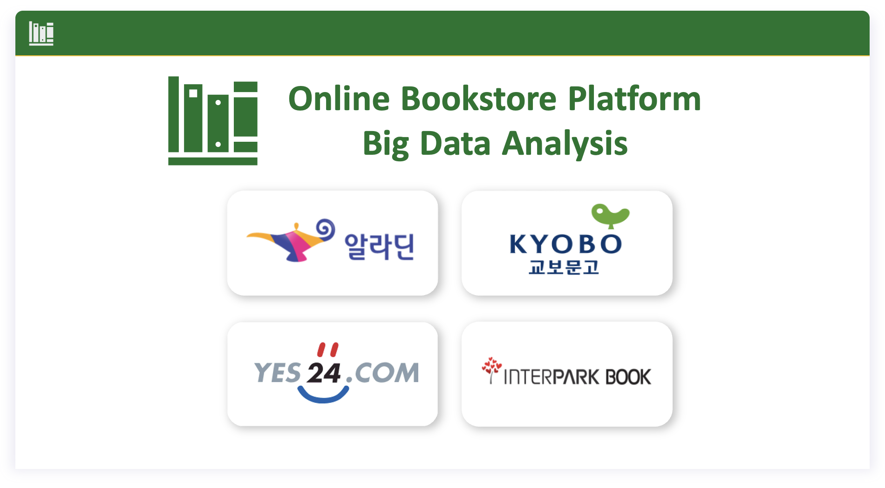
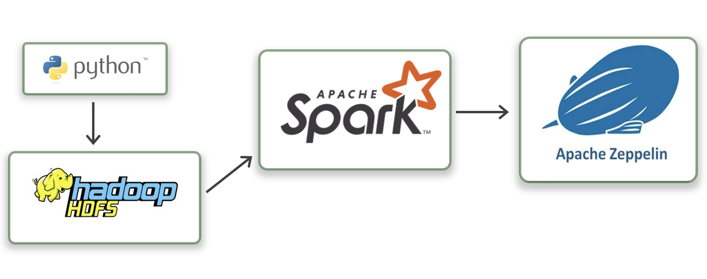

# Online Bookstore Platform Big Data Analysis

<p align="center">
    
</p>

## Data Acquisition

### Install
```
pip install -r requirements.txt
```

### Crawling Data
```
python book_category.csv
python get_book_info_and_bookstore_url.py
python get_book_data.py
```

1. [book_category.csv](https://github.com/seoh02h/online-bookstore-platform-big-data-analysis/blob/main/book_category.csv)
 * main_category
 * sub_category
 * url
2. [book_info_and_bookstore_url.csv](https://github.com/seoh02h/online-bookstore-platform-big-data-analysis/blob/main/book_info_and_bookstore_url.csv) 
 * main_category
 * sub_category
 * book_id
 * book_title
 * aladin
 * kyobo
 * yes24
 * interpark
3. [book_data_for_demo.csv](https://github.com/seoh02h/online-bookstore-platform-big-data-analysis/blob/main/book_data_for_demo.csv)
> Use this file for Analysis. (For demo only get a little bit of data)
 * main_category
 * sub_category
 * book_id
 * book_title
 * aladin_price
 * aladin_star
 * aladin_review
 * kyobo_price
 * kyobo_star
 * kyobo_review
 * yes24_price
 * yes24_star
 * yes24_review
 * interpark_price
 * interpark_star
 * interpark_review
 
## Data Analysis
show [Demo.ipynb](https://github.com/seoh02h/online-bookstore-platform-big-data-analysis/blob/main/Demo.ipynb)

## System Design
<p align="center">
    
</p>